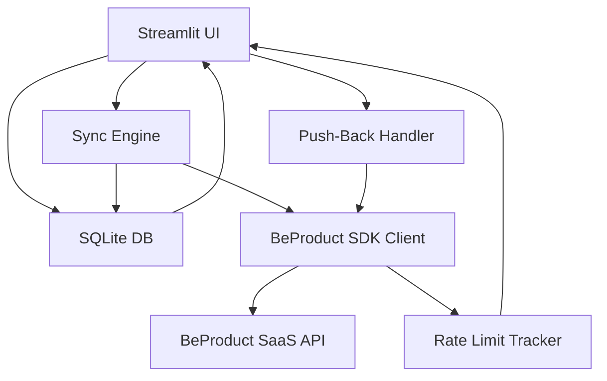

# BeProduct Data Browser — Implementation Plan

## Overview

A **Streamlit-based web app** that:
1. Downloads and locally caches BeProduct PLM data (Styles, Materials, Colors, Directory) into an SQLite database
2. Provides a browser UI to inspect and edit records locally
3. Pushes edits back to the BeProduct SaaS via the Python SDK
4. Displays API rate limit / quota usage in real-time

---

## Technology Decisions

| Concern | Decision | Rationale |
|---|---|---|
| Language | Python 3.11+ | SDK is Python-native |
| SDK | `beproduct` PyPI package | Official wrapper, saves auth plumbing |
| UI | Streamlit | Python-only, fast to build, good for data tables and forms |
| Local DB | SQLite (via `sqlite3` stdlib) | Zero ops, portable, JSON blob columns handle variable schema |
| Auth / Secrets | `.env` file + `python-dotenv` | Simple, no secret in code |
| Scheduling / sync | `apscheduler` (background thread) | Run incremental sync every N minutes without leaving the Streamlit app |

---

## Data Scope

| Entity | SDK Client | Read | Write |
|---|---|---|---|
| Style folders | `client.style.folders()` | ✅ | ❌ |
| Styles | `client.style.attributes_list/get` | ✅ | ✅ `attributes_update` |
| Material folders | `client.material.folders()` | ✅ | ❌ |
| Materials | `client.material.attributes_list/get` | ✅ | ✅ `attributes_update` |
| Color palette folders | `client.color.folders()` | ✅ | ❌ |
| Color palettes | `client.color.attributes_list/get` | ✅ | ✅ `attributes_update` |
| Directory records | `client.directory.directory_list/get` | ✅ | ✅ `directory_add` / `directory_contact_add` |

> Apps (Form, Grid, BOM, SKU etc.) are **phase-2** scope — not in initial browser.

---

## Project Structure

```
beproduct-data-browser/
├── .env.example                # template for credentials
├── .gitignore
├── README.md
├── requirements.txt
├── plans/
│   └── beproduct-data-browser-plan.md
├── app/
│   ├── __init__.py
│   ├── config.py               # load .env, expose settings
│   ├── beproduct_client.py     # singleton BeProduct SDK client + rate-limit tracker
│   ├── db.py                   # SQLite connection, schema init, CRUD helpers
│   ├── sync.py                 # sync engine: full + incremental sync per entity
│   ├── models.py               # Python dataclasses for Style, Material, Color, Directory
│   └── ui/
│       ├── __init__.py
│       ├── main.py             # Streamlit entrypoint (streamlit run app/ui/main.py)
│       ├── sidebar.py          # navigation, sync controls, rate-limit display
│       ├── styles_page.py      # style list + detail/edit view
│       ├── materials_page.py   # material list + detail/edit view
│       ├── colors_page.py      # color palette list + detail/edit view
│       └── directory_page.py   # directory records list + detail view
└── data/
    └── beproduct.db            # SQLite database (gitignored)
```

---

## SQLite Schema

Each entity table follows the same pattern: indexed top-level fields + full JSON blob.

```sql
-- Styles
CREATE TABLE IF NOT EXISTS styles (
    id            TEXT PRIMARY KEY,
    folder_id     TEXT,
    folder_name   TEXT,
    header_number TEXT,
    header_name   TEXT,
    active        INTEGER,          -- 0/1
    created_at    TEXT,
    modified_at   TEXT,
    synced_at     TEXT,             -- local timestamp of last sync
    is_dirty      INTEGER DEFAULT 0,-- 1 = locally modified, pending push
    data_json     TEXT              -- full JSON blob from API
);

-- Materials
CREATE TABLE IF NOT EXISTS materials (
    id            TEXT PRIMARY KEY,
    folder_id     TEXT,
    folder_name   TEXT,
    header_number TEXT,
    header_name   TEXT,
    active        INTEGER,
    created_at    TEXT,
    modified_at   TEXT,
    synced_at     TEXT,
    is_dirty      INTEGER DEFAULT 0,
    data_json     TEXT
);

-- Color Palettes
CREATE TABLE IF NOT EXISTS colors (
    id            TEXT PRIMARY KEY,
    folder_id     TEXT,
    folder_name   TEXT,
    header_number TEXT,
    header_name   TEXT,
    active        INTEGER,
    created_at    TEXT,
    modified_at   TEXT,
    synced_at     TEXT,
    is_dirty      INTEGER DEFAULT 0,
    data_json     TEXT
);

-- Directory
CREATE TABLE IF NOT EXISTS directory (
    id            TEXT PRIMARY KEY,
    directory_id  TEXT,             -- business ID
    name          TEXT,
    partner_type  TEXT,
    country       TEXT,
    active        INTEGER,
    synced_at     TEXT,
    is_dirty      INTEGER DEFAULT 0,
    data_json     TEXT
);

-- Sync metadata
CREATE TABLE IF NOT EXISTS sync_meta (
    entity        TEXT PRIMARY KEY, -- 'styles', 'materials', 'colors', 'directory'
    last_sync_at  TEXT,             -- ISO timestamp of last successful full/incremental sync
    sync_type     TEXT              -- 'full' or 'incremental'
);

-- Rate limit log (last N entries per entity)
CREATE TABLE IF NOT EXISTS rate_limit_log (
    id            INTEGER PRIMARY KEY AUTOINCREMENT,
    entity        TEXT,
    timestamp     TEXT,
    requests_used INTEGER,
    requests_limit INTEGER,
    reset_at      TEXT
);
```

---

## Sync Engine Strategy

### Full Sync (first run or manual trigger)
1. Call `client.<entity>.folders()` → store folder metadata in memory
2. Call `client.<entity>.attributes_list()` iterator → upsert each record into SQLite
3. Update `sync_meta.last_sync_at`

### Incremental Sync (scheduled, default every 15 min)
1. Read `sync_meta.last_sync_at` for each entity
2. Apply filter: `{'field': 'ModifiedAt', 'operator': 'Gt', 'value': last_sync_at}`
3. Upsert changed records only
4. Update `sync_meta.last_sync_at`

### Conflict Policy
- **Remote wins** for records not marked `is_dirty=1`
- **Local wins** for `is_dirty=1` records — they will be pushed back before next pull

---

## Rate Limit Tracking

BeProduct API returns rate-limit headers on each HTTP response (standard pattern: `X-RateLimit-Limit`, `X-RateLimit-Remaining`, `X-RateLimit-Reset`). Since the SDK wraps `requests`, we can subclass or monkey-patch the session to capture these headers after each call.

The sidebar will show a progress bar for `requests used / limit` and a countdown to reset.

> **Note**: Official header names need to be confirmed once connected to a live API. If not exposed via headers, we will track call counts locally only.

---

## Streamlit UI Layout

```
┌─────────────────────────────────────────────────────────────┐
│ SIDEBAR                        │ MAIN CONTENT AREA           │
│                                │                             │
│ [BeProduct Data Browser]       │ ┌─────────────────────────┐│
│                                │ │ Table: Styles            ││
│ Navigation:                    │ │ Search / Filter bar      ││
│  • Styles                      │ │ Paginated data grid      ││
│  • Materials                   │ └─────────────────────────┘│
│  • Colors                      │                             │
│  • Directory                   │ [Click row → Detail View]   │
│                                │ ┌─────────────────────────┐│
│ Sync Controls:                 │ │ Style Detail             ││
│  [Full Sync]  [Incremental]    │ │  Fields (editable)       ││
│  Last sync: 2min ago           │ │  Colorways               ││
│                                │ │  Sizes                   ││
│ API Rate Limit:                │ │  [Push to BeProduct SaaS]││
│  ████░░░░ 400/1000             │ └─────────────────────────┘│
│  Resets in: 45 min             │                             │
│                                │                             │
│ Status: ● Connected            │                             │
└─────────────────────────────────────────────────────────────┘
```

---

## Push-Back (Write) Workflow

1. User clicks an entity row → opens detail view
2. Editable fields rendered as `st.text_input` / `st.selectbox`
3. User edits values → clicks **"Save Locally"** → sets `is_dirty=1`, updates local JSON
4. User clicks **"Push to BeProduct"** → calls SDK `attributes_update()` → clears `is_dirty`
5. On error, show error message and retain `is_dirty=1`

**Supported write operations by entity:**

| Entity | Write Operation |
|---|---|
| Style | `client.style.attributes_update(header_id, fields, colorways, sizes)` |
| Material | `client.material.attributes_update(header_id, fields, colorways, sizes, suppliers)` |
| Color Palette | `client.color.attributes_update(header_id, fields, colors)` |
| Directory | `client.directory.directory_add(fields)` + `directory_contact_add()` |

---

## Authentication Flow — How It Works

BeProduct uses **OAuth 2.0 Authorization Code** flow via identity server at `https://id.winks.io`.

### One-Time Token Bootstrap (done manually BEFORE running the app)

This is a **one-time human step** — not automated by the app:

```
Step 1: Open browser →
  https://id.winks.io/ids/connect/authorize
    ?client_id=YOUR_CLIENT_ID
    &response_type=code
    &scope=openid+profile+email+roles+offline_access+BeProductPublicApi
    &redirect_uri=YOUR_CALLBACK_URL

Step 2: Login with your BeProduct user → browser redirects to:
  YOUR_CALLBACK_URL?code=6850c396e36e42ddcbc5af2844bd18ef  ← copy this code

Step 3: Exchange code for tokens (run once in terminal):
  curl --request POST \
    --url 'https://id.winks.io/ids/connect/token' \
    --header 'content-type: application/x-www-form-urlencoded' \
    --data grant_type=authorization_code \
    --data client_id=YOUR_CLIENT_ID \
    --data client_secret=YOUR_CLIENT_SECRET \
    --data code=YOUR_AUTHORIZATION_CODE \
    --data 'redirect_uri=YOUR_CALLBACK_URL'

Step 4: Copy refresh_token from JSON response → put in .env
```

### Runtime Token Handling (fully automated by SDK)

Once the `refresh_token` is in `.env`, the **BeProduct Python SDK handles everything automatically**:
- Uses `refresh_token` + `client_id` + `client_secret` to obtain a new `access_token` (valid 8h)
- Automatically refreshes on expiry — **no user interaction ever needed again**
- `refresh_token` does **not expire** unless revoked by BeProduct support

```python
# This is all that's needed at runtime:
from beproduct.sdk import BeProduct
client = BeProduct(
    client_id=settings.CLIENT_ID,
    client_secret=settings.CLIENT_SECRET,
    refresh_token=settings.REFRESH_TOKEN,
    company_domain=settings.COMPANY_DOMAIN
)
# SDK silently refreshes access_token as needed
```

### Security Notes
- `refresh_token` is a **long-lived secret** — treat like a password
- Store only in `.env` file, never commit to git (`.gitignore` covers it)
- Token is user-scoped: API calls are impersonated as the user who did the browser login
- To rotate: repeat Steps 1-4 above, update `.env`

---

## Configuration (`.env`)

```env
BEPRODUCT_CLIENT_ID=your_client_id
BEPRODUCT_CLIENT_SECRET=your_client_secret
BEPRODUCT_REFRESH_TOKEN=your_refresh_token   # obtained via one-time browser auth flow
BEPRODUCT_COMPANY_DOMAIN=YourCompanyDomain   # from URL: us.beproduct.com/YourCompanyDomain
SYNC_INTERVAL_MINUTES=15
DB_PATH=data/beproduct.db
```

---

## Key Dependencies (`requirements.txt`)

```
beproduct>=latest
streamlit>=1.32
apscheduler>=3.10
python-dotenv>=1.0
pandas>=2.2          # for data table display in Streamlit
```

---

## Architecture Diagram



---

## Implementation Phases

### Phase 1 — Project Scaffold
- Create directory structure
- Create `requirements.txt`, `.env.example`, `.gitignore`
- `app/config.py` — load env vars with validation

### Phase 2 — BeProduct Client Layer
- `app/beproduct_client.py` — singleton `BeProduct` client
- HTTP session interceptor to capture rate-limit headers
- Expose `get_rate_limit_status()` helper

### Phase 3 — SQLite Local Store
- `app/db.py` — connection factory, `init_schema()`, `upsert_record()`, `get_records()`, `mark_dirty()`, `mark_clean()`

### Phase 4 — Sync Engine
- `app/sync.py` — `full_sync(entity)`, `incremental_sync(entity)`, `sync_all()`
- APScheduler background job wired into Streamlit session

### Phase 5 — Streamlit UI Shell
- `app/ui/main.py` — page routing
- `app/ui/sidebar.py` — navigation, sync buttons, rate-limit widget

### Phase 6 — Data Pages
- `app/ui/styles_page.py` — list table + detail with editable fields + push button
- `app/ui/materials_page.py` — same pattern
- `app/ui/colors_page.py` — same pattern
- `app/ui/directory_page.py` — list + detail (read-heavy, limited write)

### Phase 7 — Push-Back Handler
- Validate dirty records
- Call correct SDK method per entity type
- Handle errors, display success/failure

### Phase 8 — Config and Packaging
- Ensure `.env` is documented
- `streamlit run app/ui/main.py` is the sole entrypoint

### Phase 9 — Documentation
- `README.md` — setup, credentials, first run, usage
